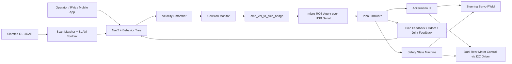
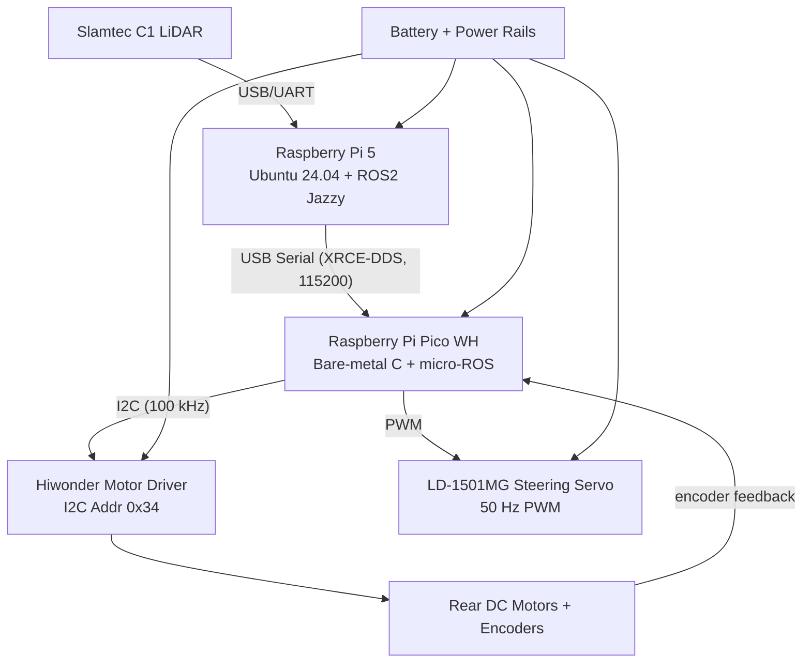
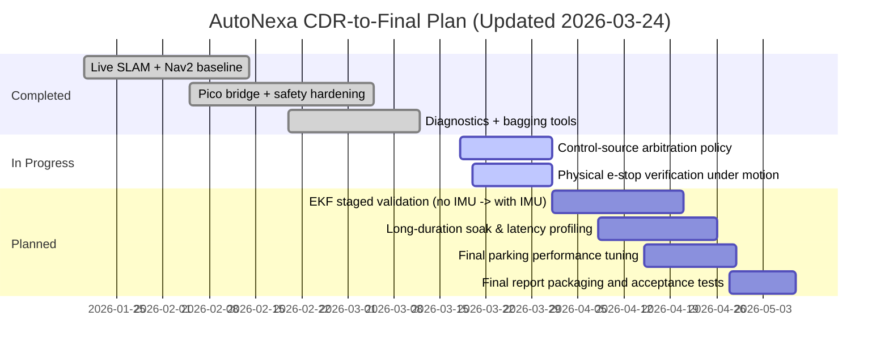
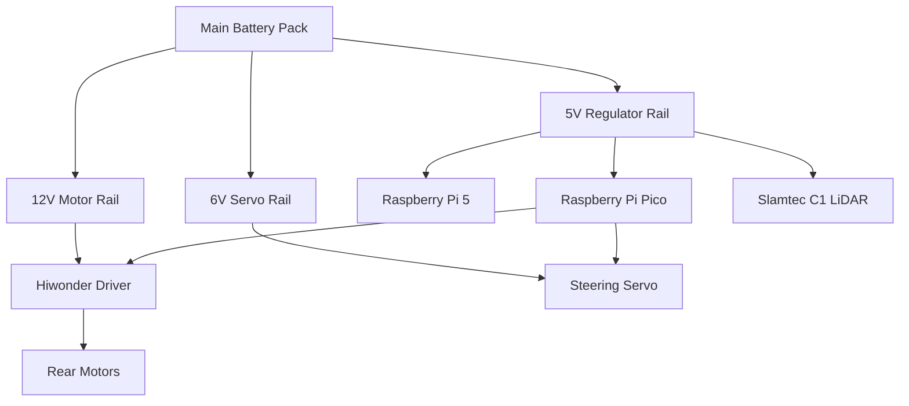

# AutoNexa Critical Design Review Report (CDRR)

**Project:** AutoNexa Autonomous Parking System  
**Course/Context:** EE494 Design Project  
**Report Type:** Critical Design Review Report (CDRR)  
**Revision:** v1.0  
**Date:** 2026-03-24

---

## 1. Executive Summary

This CDRR presents the near-final design status of the AutoNexa autonomous parking system and demonstrates readiness to proceed toward full fabrication, integration validation, and field testing. The system architecture is centered on a Raspberry Pi 5 (high-level autonomy), a Raspberry Pi Pico (low-level deterministic actuation), and a Slamtec C1 LiDAR (perception). The software stack is ROS2 Jazzy with Nav2 and SLAM Toolbox.

Current design maturity is estimated at **80–85% overall**, with **critical safety and command pipeline modules frozen at 100% functional design** and under integration testing. Remaining work is focused on performance tuning, power optimization under load, formal verification test coverage expansion, and full closed-loop physical trials.

---

## 2. System Overview (Top-Down)

## 2.1 Mission and Scope

AutoNexa is designed to:
- Build a local occupancy map in real-time from LiDAR.
- Plan and execute collision-aware navigation to target parking poses.
- Convert high-level velocity commands into Ackermann-compatible steering and traction control.
- Enforce command safety via timeout, heartbeat, and emergency-stop logic.

## 2.2 Overall Functional Architecture (System Level)

## 2.3 Physical/Hardware Block Diagram

## 2.4 Main Control and Data Signals

| Signal | Source | Destination | Type | Purpose |
|---|---|---|---|---|
| `/scan` | LiDAR driver | SLAM, scan matcher, Nav2 costmaps | `LaserScan` | Environment sensing |
| `/cmd_vel` | Nav2 controller | velocity smoother | `Twist` | Raw motion command |
| `/cmd_vel_smoothed` | velocity smoother | collision monitor | `Twist` | Limited command |
| `/cmd_vel_safe` | collision monitor | Pico bridge | `Twist` | Safety-filtered command |
| `/pico/control_cmd` | Pico bridge | Pico firmware | `TwistStamped` | Final command to MCU |
| `/pico/enable` | Pico bridge | Pico firmware | `Bool` | Motor enable/disable |
| `/pico/heartbeat` | Pico bridge | Pico firmware | `Bool` | Liveness check |
| `/pico/odom` | Pico firmware | ROS2 stack | Odometry | Vehicle motion feedback |
| `/tf`, `/tf_static` | multiple nodes | all consumers | TF transforms | Frame consistency |

---

## 3. Design Evolution Since Conceptual Design Report

## 3.1 Major Modifications

1. **Architecture shift to live SLAM + Nav2 baseline**  
   Previous static-map-dominant flows were de-emphasized in favor of robust live mapping and navigation.

2. **Deterministic command safety chain introduced and hardened**  
   Final chain now includes smoothing, collision filtering, rate/acceleration limits, heartbeat, timeout-to-zero, and duplicate-publisher protection.

3. **Pico bridge hardening and fault containment**  
   Lock-file and ROS graph checks prevent unsafe concurrent command sources.

4. **Diagnostic and observability tooling added**  
   Dedicated scripts provide topic checks, flow checks, and standardized rosbag captures.

5. **EKF integration skeleton added (no IMU yet)**  
   Robot localization pipeline prepared for next fusion phase while avoiding TF conflicts.

## 3.2 Components Intentionally Unmodified (and justification)

- **Slamtec C1 LiDAR as primary perception sensor:** retained due to acceptable scan quality and integration maturity.
- **Navfn + DWB conservative planner/controller baseline:** retained for stability while Ackermann-specialized tuning remains controlled.
- **Pico as low-level actuator controller:** retained because deterministic control and direct hardware interfacing are better suited to an MCU than SBC userspace.

## 3.3 Evidence Summary (supporting material)

- Repeated successful build/syntax and launch-argument validation.
- Reproduced and resolved LiDAR timeout root cause (stale process port lock).
- Duplicate publisher guard tested with safe stop + self-shutdown behavior.
- Diagnostic tooling used to verify topic-type integrity and live flow conditions.

---

## 4. Detailed Requirements and Standards (Top-Down)

## 4.1 System-Level Requirements

| ID | Requirement | Target |
|---|---|---|
| SYS-01 | Autonomous navigation in small indoor parking environment | Functional completion in constrained map |
| SYS-02 | Collision-aware command output | No direct unsafe command path to actuators |
| SYS-03 | Safe stop on command loss | Timeout ≤ 200 ms |
| SYS-04 | Deterministic command update | Bridge publish rate 30 Hz nominal |
| SYS-05 | Modular subsystem interfaces | ROS2 topics + strict topic typing |
| SYS-06 | Incremental integration path | Subsystems testable independently |

## 4.2 Subsystem Requirements

### A) Perception & Localization
- LiDAR acquisition stability with no persistent timeout condition.
- Stable `/scan` stream for scan matcher and SLAM.
- Coherent `map -> odom -> base_link` TF chain.

### B) Planning & Navigation
- Path generation from pose goals.
- Local obstacle handling through costmaps and collision monitor.
- Conservative kinematic limits compatible with current chassis.

### C) Command Bridge & Safety
- Velocity clamping and acceleration limiting.
- Timeout-to-zero and heartbeat enforcement.
- Duplicate-publisher detection and safe-fail behavior.

### D) Embedded Control (Pico)
- Ackermann IK conversion from body command.
- Steering PWM and dual rear motor command generation.
- Encoder feedback ingestion for odometry/joint feedback.

## 4.3 Relevant Standards and Compliance Mapping

| Domain | Standard / Convention | Compliance Status |
|---|---|---|
| ROS middleware | DDS / XRCE-DDS transport model | Implemented via ROS2 + micro-ROS agent |
| Serial comm | USB CDC serial framing | Implemented |
| I2C bus | NXP I2C standard mode (100 kHz) | Implemented |
| Servo control | RC servo PWM 50 Hz convention | Implemented |
| Units | SI units (m, rad, s) in command interfaces | Implemented |
| Software quality | Modular package + diagnostics + staged validation | Partially complete (formal CI expansion pending) |

> Note: Functional safety is handled through project-level safety mechanisms (timeout, estop priority, command arbitration) rather than claiming compliance with automotive certification frameworks.

---

## 5. Subsystem Compatibility and Interface Compliance

## 5.1 Compatibility Discussion

- **Nav2 output compatibility:** Standard `Twist` output is converted to MCU command interface using bridge-level conditioning and bounds.
- **Pico compatibility:** MCU accepts bounded command rates and enforces safety mode transitions.
- **Localization compatibility:** SLAM/scan-matcher and optional EKF are configured to avoid TF authority conflicts.
- **Multi-source command compatibility:** Current system supports both Nav2 and mobile inputs but requires explicit control-source arbitration for production-level safety.

## 5.2 Interface Risks and Mitigations

| Risk | Impact | Mitigation |
|---|---|---|
| Multiple publishers on `/pico/*` | Unsafe command conflicts | Lock file + duplicate-publisher watchdog |
| Stale process on serial port | Sensor data loss | Preflight checks + by-id serial usage |
| Missing IMU in fusion | Drift during dynamics | Keep EKF optional and staged until IMU integration |
| Manual mode conflicts | Control instability | Introduce explicit AUTO/MANUAL/ESTOP arbitration policy |

---

## 6. Customer and Engineering Requirement Satisfaction

Current evidence indicates the system can satisfy both customer and engineering requirements at CDR stage:

- **Customer-facing objectives:** autonomous map-aware navigation and parking-oriented goal handling are functionally present.
- **Engineering objectives:** deterministic low-level control path and safety interlocks are implemented.
- **Readiness:** critical architecture decisions are frozen; remaining scope is test-depth and performance optimization rather than fundamental redesign.

---

## 7. Verification Results, Problems, and Solutions

## 7.1 Completed Verification Activities

1. Build verification for updated ROS2 scripts and launch files.
2. Launch argument contract checks for major launch entry points.
3. LiDAR fault reproduction and recovery validation.
4. Control-chain diagnostics (topic/type and live-flow modes).
5. Duplicate publisher fault injection test.
6. Rosbag recorder validation for standardized traces.

## 7.2 Key Problems Encountered

| Problem | Root Cause | Implemented / Proposed Solution |
|---|---|---|
| LiDAR timeout and RViz queue saturation | Stale process holding `/dev/ttyUSB0` | Kill stale process, enforce preflight and by-id port discipline |
| Duplicate bridge command source | Multiple bridge processes or publishers | Lock-file mechanism + graph detection + safe stop |
| Limited fusion robustness | IMU not yet available | EKF staging with current odom source, then IMU integration |
| Possible manual/auto command conflict | No finalized ownership policy | Implement explicit mode arbitration service/topic |

---

## 8. Robustness Analysis Against Error Sources

## 8.1 Expected Error Sources

- Serial communication interruptions.
- Topic-level command conflicts.
- Odometry drift in dynamic maneuvers.
- Sensor dropouts or stale data.
- Operator sequencing errors during bring-up.

## 8.2 Robustness Mechanisms

- Timeout-to-zero + motor disable fallback.
- Heartbeat supervision.
- Duplicate publisher detection with safe self-termination behavior.
- Conservative velocity and acceleration limits before actuation.
- Diagnostic scripts and preflight checks to prevent bad run-state.

## 8.3 Residual Risks

- Full estop latency under real motion still needs formal timing characterization.
- Long-duration thermal and stability soak tests are not yet complete.
- Arbitration between mobile/manual and autonomous command paths is pending formal closure.

---

## 9. Updated Cost Breakdown and Trade-Off Analysis

> Cost values below are updated engineering estimates for CDR planning and may vary by supplier/date.

| Item | Qty | Unit Cost (USD) | Subtotal (USD) | Notes |
|---|---:|---:|---:|---|
| Raspberry Pi 5 (8GB) | 1 | 90 | 90 | High-level compute |
| Raspberry Pi Pico WH | 1 | 10 | 10 | Real-time actuator control |
| Slamtec C1 LiDAR | 1 | 130 | 130 | Primary ranging sensor |
| Ackermann chassis + steering linkage | 1 | 120 | 120 | Mechanical base |
| Rear DC motors w/ encoders | 2 | 25 | 50 | Propulsion feedback |
| Steering servo (LD-1501MG class) | 1 | 18 | 18 | Front steering |
| Hiwonder motor driver board | 1 | 30 | 30 | I2C motor interface |
| Battery + regulator/power module | 1 | 55 | 55 | Multi-rail supply |
| Wiring, connectors, prototyping hardware | 1 | 35 | 35 | Integration consumables |
| Contingency (10%) | - | - | 54 | Risk buffer |
| **Total Estimated Cost** |  |  | **592 USD** |  |

### Trade-off summary
- Chosen architecture prioritizes deterministic safety and modular debugging over aggressive early performance.
- MCU offloading increases integration complexity slightly but significantly improves low-level timing predictability and recoverability.

---

## 10. Updated Development Schedule (Gantt)

---

## 11. Power Distribution and Power Management Analysis

## 11.1 Power Distribution Diagram

## 11.2 Estimated Power Budget

| Subsystem | Nominal Power | Peak/Transient | Notes |
|---|---:|---:|---|
| Raspberry Pi 5 | 8–12 W | 15 W | Depends on CPU/GPU load |
| LiDAR C1 | 2–3 W | 3.5 W | Continuous scan |
| Pico WH | <1 W | 1 W | Low-power MCU |
| Steering Servo | 2–5 W | 10 W | Peak during rapid steering |
| Dual Motors + Driver | 10–25 W | 40+ W | Strongly load dependent |
| **Total** | **22–46 W** | **~70 W peak** | Sizing with margin required |

## 11.3 Power Management Strategy

- Separate logic rail from high-current actuation rails.
- Maintain common ground and noise-aware wiring layout.
- Enforce software limits on acceleration to reduce current spikes.
- Use watchdog and fail-safe stop on undervoltage/communication faults (implementation pending optional voltage telemetry integration).

---

## 12. Design Completion Status and Freeze Statement

- **Overall design completion:** ~80–85%.
- **Critical module completion:**
  - Command/safety software chain: **100% design frozen**.
  - Pico low-level control architecture: **100% design frozen** (tuning iterative).
  - System-level launch and integration architecture: **100% frozen**.
- **Remaining:** verification depth, fusion enhancement with IMU, and closed-loop performance tuning.

This status satisfies the CDR expectation that critical modules are frozen and most product design is complete.

---

## 13. Conclusion

AutoNexa has reached a robust CDR milestone where architectural uncertainty is low, safety foundations are in place, and subsystem interfaces are clearly defined. The program is ready to transition from design-heavy iteration into structured fabrication/integration completion and high-confidence demonstration testing.

---

## Appendix A — Suggested Figures/Tables to Include in Final Submission Package

1. System architecture block diagram (high-level).
2. Hardware wiring/power diagram.
3. Command dataflow and feedback loop diagram.
4. Subsystem requirement traceability matrix.
5. Risk register and mitigation status table.
6. Cost comparison table versus alternatives.
7. Gantt chart with critical path highlighted.
8. Bench/field validation result summary tables.

## Appendix B — Scope of Software Content Included

Per course guidance, this report intentionally avoids source-code listings in the main body. Only software architecture, interfaces, safety logic, and verification evidence are documented.
